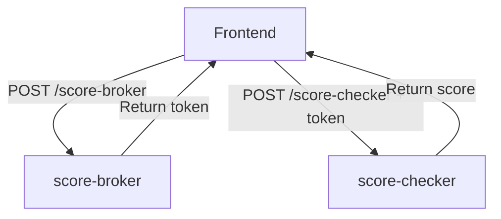

# System Architecture: DataboxMVL Secure Credit Scoring

## Overview

This document describes the system architecture for DataboxMVL's secure credit scoring flow, including trust boundaries, component interactions, and secrets management locations.

## High-Level Architecture

```
┌─────────────────────────────────────────────────────────────────────┐
│                         UNTRUSTED ZONE                              │
│  ┌───────────────────────────────────────────────────────────────┐  │
│  │  Frontend Application (GitHub Pages)                          │  │
│  │  https://lisandrosuarez9-lab.github.io                        │  │
│  │                                                                │  │
│  │  - React SPA (Vite build)                                     │  │
│  │  - User intake forms (PII collection)                         │  │
│  │  - Feature flag: VITE_SCORE_MODE (demo|secure)                │  │
│  │  - No secrets stored in code                                  │  │
│  └─────────────────┬─────────────────────────┬───────────────────┘  │
│                    │                         │                      │
└────────────────────┼─────────────────────────┼──────────────────────┘
                     │                         │
                     │ HTTPS + CORS            │ HTTPS + CORS
                     │                         │
┌────────────────────┼─────────────────────────┼──────────────────────┐
│                    │                         │                      │
│  ┌─────────────────▼──────────────┐   ┌──────▼──────────────────┐  │
│  │  Edge Function:                │   │  Edge Function:         │  │
│  │  score-broker                  │   │  score-checker          │  │
│  │  (NEW - Phase 0)               │   │  (EXISTING - Updated)   │  │
│  │                                │   │                         │  │
│  │  POST /score-broker            │   │  POST /score-checker    │  │
│  │  - Validate input (PII)        │   │  - Validate token       │  │
│  │  - Generate correlation_id     │   │  - Process PII          │  │
│  │  - Create nonce                │   │  - Calculate score      │  │
│  │  - Issue token (demo/secure)   │   │  - Return results       │  │
│  │  - Hash national_id for logs   │   │  - Echo correlation_id  │  │
│  │  - Structured JSON logging     │   │  - Structured logging   │  │
│  │                                │   │                         │  │
│  │  SECRETS (Phase 1+):           │   │  SECRETS (Phase 1+):    │  │
│  │  - TOKEN_SIGNING_KEY (sign)    │   │  - TOKEN_SIGNING_KEY    │  │
│  │                                │   │    (verify)             │  │
│  └────────────────────────────────┘   └─────────────────────────┘  │
│                                                                     │
│                    TRUSTED ZONE (Supabase Edge Functions)          │
└─────────────────────────────────────────────────────────────────────┘
```

## Data Flow Diagrams

### Demo Mode Flow (Phase 0)

```
┌──────────┐                                      ┌──────────────┐
│          │                                      │              │
│ Frontend │                                      │score-checker │
│          │                                      │              │
└─────┬────┘                                      └──────┬───────┘
      │                                                  │
      │  POST /score-checker                            │
      │  Headers:                                       │
      │    Content-Type: application/json               │
      │    x-correlation-id: <auto-gen>                 │
      │  Body: { full_name, email, national_id, ... }   │
      ├─────────────────────────────────────────────────>│
      │                                                  │
      │                                              ┌───▼───┐
      │                                              │Validate│
      │                                              │ Input  │
      │                                              └───┬───┘
      │                                                  │
      │                                              ┌───▼───┐
      │                                              │Process│
      │                                              │ Score │
      │                                              └───┬───┘
      │                                                  │
      │  200 OK                                          │
      │  { borrower, score, enrichment, correlation_id }│
      │<─────────────────────────────────────────────────┤
      │                                                  │
┌─────▼────┐                                      ┌──────┴───────┐
│ Display  │                                      │   Log Event  │
│ Results  │                                      │(correlation) │
└──────────┘                                      └──────────────┘
```

### Secure Mode Flow (Phase 1+)

```
┌──────────┐        ┌─────────────┐        ┌──────────────┐
│          │        │             │        │              │
│ Frontend │        │score-broker │        │score-checker │
│          │        │             │        │              │
└─────┬────┘        └──────┬──────┘        └──────┬───────┘
      │                    │                      │
      │  1. POST /score-broker                    │
      │     Body: { full_name, email, national_id }│
      ├────────────────────>│                      │
      │                    │                      │
      │                 ┌──▼──┐                   │
      │                 │Hash │                   │
      │                 │ PII │                   │
      │                 └──┬──┘                   │
      │                    │                      │
      │                 ┌──▼──┐                   │
      │                 │Issue│                   │
      │                 │Token│                   │
      │                 └──┬──┘                   │
      │                    │                      │
      │  2. 200 OK         │                      │
      │     { token, ttl_seconds, correlation_id }│
      │<────────────────────┤                      │
      │                    │                      │
      │                    │                      │
      │  3. POST /score-checker                   │
      │     Authorization: Bearer <token>         │
      │     Body: { full_name, email, ... }       │
      ├───────────────────────────────────────────>│
      │                                            │
      │                                        ┌───▼───┐
      │                                        │Verify │
      │                                        │Token  │
      │                                        └───┬───┘
      │                                            │
      │                                        ┌───▼───┐
      │                                        │Process│
      │                                        │ Score │
      │                                        └───┬───┘
      │                                            │
      │  4. 200 OK                                 │
      │     { borrower, score, enrichment, correlation_id }│
      │<────────────────────────────────────────────┤
      │                                            │
┌─────▼────┐                                ┌──────┴───────┐
│ Display  │                                │   Log Event  │
│ Results  │                                │(correlation) │
└──────────┘                                └──────────────┘
```

## Trust Boundaries

### Boundary 1: Frontend (Untrusted)

**Zone**: Public internet, GitHub Pages CDN

**Characteristics**:
- No secret storage (all code is publicly visible)
- User input validation (client-side)
- HTTPS encryption for data in transit
- CORS origin restricted to `lisandrosuarez9-lab.github.io`

**Security Assumptions**:
- Code can be modified by user (DevTools, browser extensions)
- Network traffic visible to user
- Cannot trust client-side validation alone

### Boundary 2: Edge Functions (Trusted)

**Zone**: Supabase Edge Runtime (Deno)

**Characteristics**:
- Server-side validation (authoritative)
- Secret storage via Supabase secrets management
- Isolated runtime per function invocation
- Structured logging to Supabase logs

**Security Assumptions**:
- Code runs in secure, isolated environment
- Secrets accessible only to Edge Function runtime
- Input from frontend must be validated and sanitized

### Boundary 3: Database (Future - Not Implemented in Phase 0)

**Zone**: Supabase PostgreSQL

**Characteristics**:
- RLS (Row-Level Security) policies
- Encrypted at rest
- Audit logging for sensitive operations

**Note**: Phase 0 uses demo data only (no persistent storage).

## Component Details

### Frontend (GitHub Pages)

**Technology**: React + TypeScript + Vite

**Responsibilities**:
- Render user interface (Hero, IntakeForm, ProfileCard)
- Collect PII from user (full_name, email, national_id, phone)
- Manage authentication flow based on VITE_SCORE_MODE
- Display credit score results
- Handle errors and retry logic

**Data Handling**:
- PII collected from user via form
- PII transmitted to Edge Functions over HTTPS
- No PII stored in browser (except session memory)
- No secrets or API keys in code

**Configuration**:
- `VITE_SCORE_MODE`: `demo` or `secure`
- `VITE_SUPABASE_URL`: Supabase project URL
- `VITE_SUPABASE_ANON_KEY`: Public anonymous key (not a secret)

### Edge Function: score-broker (NEW)

**Technology**: Deno (TypeScript)

**Responsibilities**:
- Validate input: `full_name`, `email`, `national_id`
- Generate `correlation_id` (UUID v4)
- Generate `nonce` (UUID v4)
- Create token payload: `{ nonce, correlation_id, exp }`
- Sign token (Phase 1+) with HMAC-SHA256 or JWT
- Return token to frontend with TTL
- Log issuance event (hash `national_id` for privacy)

**Secrets** (Phase 1+):
- `TOKEN_SIGNING_KEY`: HMAC secret or RSA private key
- Accessed via: `Deno.env.get('TOKEN_SIGNING_KEY')`
- Managed by: `supabase secrets set TOKEN_SIGNING_KEY=<value>`

**CORS Configuration**:
- `Access-Control-Allow-Origin`: `https://lisandrosuarez9-lab.github.io`
- `Access-Control-Allow-Headers`: `content-type, authorization, x-factora-client, x-correlation-id`
- `Access-Control-Allow-Methods`: `POST, OPTIONS`

**Logging** (Structured JSON):
```json
{
  "event": "token_issued",
  "correlation_id": "uuid",
  "national_id_hash": "sha256-hash",
  "email_domain": "example.com",
  "ttl_seconds": 45,
  "timestamp": "ISO-8601"
}
```

### Edge Function: score-checker (EXISTING - Updated)

**Technology**: Deno (TypeScript)

**Responsibilities**:
- Accept `x-correlation-id` header (new standard)
- Maintain backward compatibility with `x-factora-correlation-id`
- Parse `Authorization: Bearer <token>` header
- Validate token (Phase 1+: signature, expiration, nonce)
- Process credit score calculation (demo data in Phase 0)
- Return results with `correlation_id`
- Log redemption event

**Secrets** (Phase 1+):
- `TOKEN_SIGNING_KEY`: Same key as score-broker (for verification)
- Accessed via: `Deno.env.get('TOKEN_SIGNING_KEY')`

**CORS Configuration**:
- `Access-Control-Allow-Origin`: `https://lisandrosuarez9-lab.github.io`
- `Access-Control-Allow-Headers`: `content-type, authorization, x-factora-client, x-correlation-id`
- `Access-Control-Allow-Methods`: `POST, OPTIONS`

**Logging** (Structured JSON):
```json
{
  "event": "token_redeemed",
  "correlation_id": "uuid",
  "authorization_mode": "demo|secure",
  "score_result": "success|error",
  "timestamp": "ISO-8601"
}
```

## Secrets Management

### Phase 0: Demo Mode

**Secrets Required**: None

- Tokens are unsigned (`demo.<base64>` format)
- No cryptographic operations
- Relies on HTTPS and CORS for security

### Phase 1+: Secure Mode

**Secret**: `TOKEN_SIGNING_KEY`

**Type**: HMAC-SHA256 shared secret (32 bytes, base64-encoded)

**Storage Location**: Supabase Edge Function environment

**Access Pattern**:
```typescript
// score-broker (sign)
const signingKey = Deno.env.get('TOKEN_SIGNING_KEY');
const signature = hmacSHA256(payload, signingKey);

// score-checker (verify)
const signingKey = Deno.env.get('TOKEN_SIGNING_KEY');
const isValid = verifyHMAC(token, signingKey);
```

**Management Commands**:
```bash
# Set secret
supabase secrets set TOKEN_SIGNING_KEY=<base64-encoded-key>

# List secrets (names only, values hidden)
supabase secrets list

# Unset secret
supabase secrets unset TOKEN_SIGNING_KEY
```

**Key Rotation**: See `docs/KEY_MANAGEMENT.md` for rotation strategy with overlap windows.

## Network Security

### HTTPS Everywhere

- All communication uses TLS 1.2+ encryption
- Frontend hosted on GitHub Pages (HTTPS by default)
- Edge Functions accessible via Supabase HTTPS endpoints
- Certificate validation performed by browser and Deno runtime

### CORS Policy

**Allowed Origin**: `https://lisandrosuarez9-lab.github.io` (exact match)

**Rationale**:
- Prevents unauthorized websites from calling Edge Functions
- Browser enforces CORS policy (cannot be bypassed by malicious JS)
- Origin check happens before request processing

**Limitation**:
- CORS is a browser security feature (not enforced for non-browser clients)
- For production, consider adding rate limiting and API keys

## Observability

### Correlation ID Flow

```
Frontend                score-broker         score-checker
   │                         │                      │
   │──(generate UUID)──>     │                      │
   │                         │                      │
   │<──(return UUID)─────────┤                      │
   │                                                │
   │──(pass UUID in header)─────────────────────────>│
   │                                                │
   │<──(echo UUID in response)──────────────────────┤
```

**Purpose**:
- Trace requests across multiple services
- Debug errors by searching logs with correlation_id
- Monitor token lifecycle (issuance → redemption)

### Log Aggregation

All Edge Functions emit structured JSON logs:

```json
{
  "correlation_id": "uuid",
  "event": "token_issued|token_redeemed",
  "timestamp": "ISO-8601",
  "user_agent": "Mozilla/5.0...",
  "ip_address": "203.0.113.42",
  "duration_ms": 123
}
```

**View Logs**:
```bash
# Supabase CLI
supabase functions logs score-broker --follow
supabase functions logs score-checker --follow
```

**Future Enhancements**:
- Export logs to external SIEM (Datadog, Splunk)
- Metrics dashboard (token issuance rate, validation errors)
- Alerting on anomalies (high error rate, suspicious patterns)

See `docs/OBSERVABILITY.md` for complete log schema and metrics.

## Deployment Architecture

### GitHub Pages (Frontend)

```
GitHub Repository
   ├── src/          (React components)
   ├── public/       (Static assets)
   └── dist/         (Build output)
       │
       │  `npm run build`
       │  `npm run deploy`
       ▼
GitHub Pages CDN
   https://lisandrosuarez9-lab.github.io
   - Global CDN distribution
   - HTTPS by default
   - Automatic cache invalidation on deploy
```

### Supabase Edge Functions

```
Local Development
   └── supabase/functions/
       ├── score-broker/index.ts
       └── score-checker/index.ts
       │
       │  `supabase functions deploy score-broker`
       │  `supabase functions deploy score-checker`
       ▼
Supabase Edge Runtime (Deno Deploy)
   https://<project-id>.supabase.co/functions/v1/
   ├── score-broker
   └── score-checker
   - Global edge network
   - Auto-scaling
   - Built-in observability
```

## Scalability Considerations

### Frontend (GitHub Pages)
- **Horizontal scaling**: CDN handles unlimited read traffic
- **Bottleneck**: None (static assets)

### Edge Functions (Supabase)
- **Horizontal scaling**: Automatic per-request scaling
- **Stateless design**: No shared state between invocations
- **Bottleneck**: Database queries (if added in future phases)

### Token Issuance Rate
- **Phase 0**: No rate limiting
- **Future**: Implement rate limiting per IP or per user
  - E.g., 10 tokens per minute per IP
  - Use Deno KV or Redis for rate limit tracking

## Security Hardening Checklist

- [x] HTTPS for all communications
- [x] CORS origin allowlist (no wildcards)
- [x] Input validation on Edge Functions
- [x] PII hashing in logs (national_id)
- [ ] Rate limiting (future)
- [ ] DDoS protection (Cloudflare or AWS Shield)
- [ ] Token signature verification (Phase 1+)
- [ ] Nonce tracking to prevent replay attacks (Phase 2+)
- [ ] Key rotation automation (Phase 2+)

## References

- docs/SECURITY_DECISION.md: Security architecture rationale
- docs/AUTH_FLOW_CONTRACT.md: API specifications
- docs/FEATURE_FLAG.md: SCORE_MODE configuration
- docs/OBSERVABILITY.md: Logging and monitoring
- docs/KEY_MANAGEMENT.md: Key rotation strategy
- Issue #33: Phase 0 implementation tracking

## Diagram Tools

This document uses ASCII diagrams for simplicity. For interactive diagrams, consider:
- Mermaid.js (renders in GitHub markdown)
- Draw.io / Lucidchart (export as PNG/SVG)
- PlantUML (code-based diagrams)

Example Mermaid syntax:


## Version History

| Version | Date | Changes |
|---------|------|---------|
| 1.0.0 | 2025-11-08 | Initial architecture documentation (Phase 0) |
